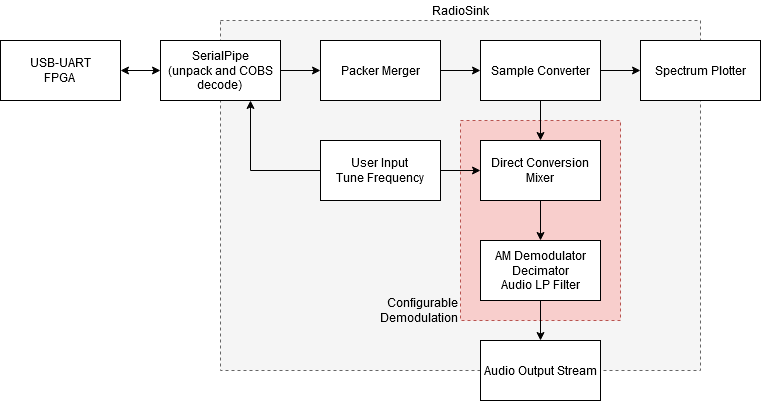

max1k-sdr-sw
==

PC Tuning and Demodulation software of MAX1k mini-SDR project 

Have a look at the RTL and RF side here: [https://github.com/fyazici/mak1k-sdr-rtl](https://github.com/fyazici/mak1k-sdr-rtl)

Software side of the MAX1k mini-SDR project consists of a few Python files. The `SerialPipe` communicates with the USB UART device, sends configuration commands and receives sample packets. Incoming samples are unpacked, COBS-decoded and sent over the stdout pipe.

`RadioSink` handles the rest. It uses Python generators as a proof of concept for fully software defined radio signal demodulation. The baseband spectrum is plotted in a Matplotlib window and the demodulated output is played through speakers in realtime (well, with some latency to help FTDI chips UART FIFOs).

SW side block diagram:

Vesti FM (MW mirror) channel received on 1413 kHz at night (all the way through the Black Sea!):

